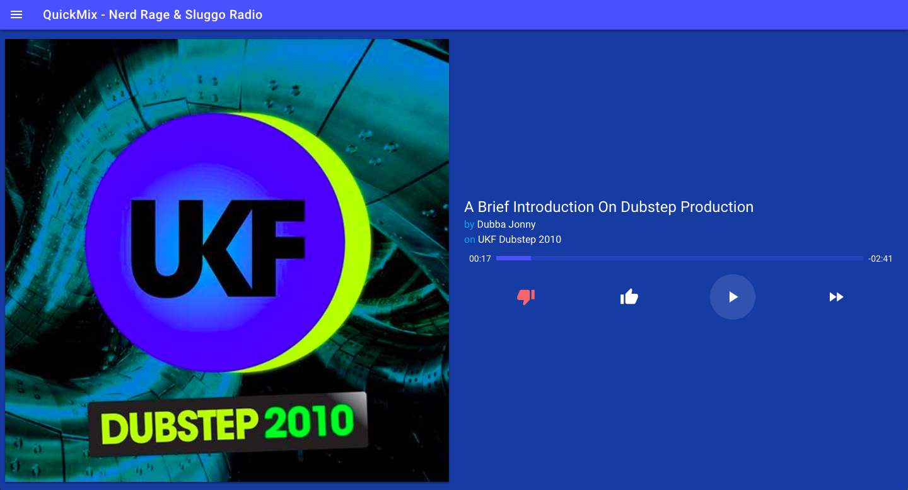
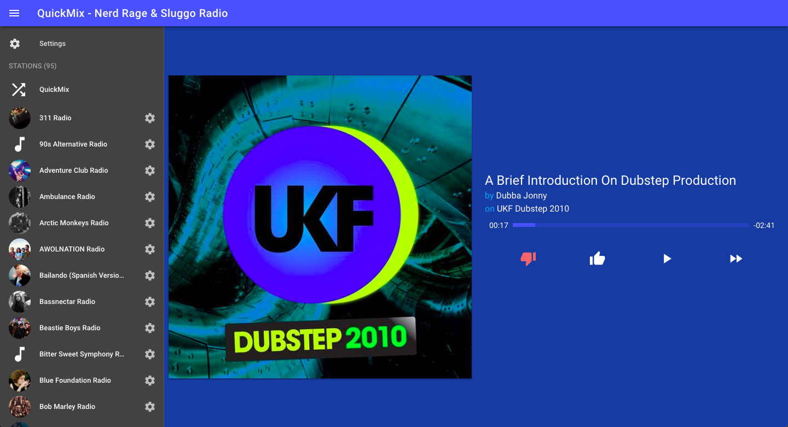
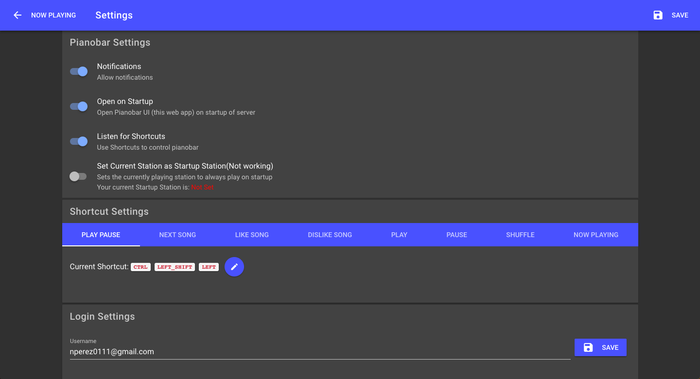

# Pianoserver
Full integration of Pandora into your computer with Notifications, Shortcuts and a Web UI.

## What this does
This project gives a Web UI for [pianobar](https://github.com/PromyLOPh/pianobar) (The console client for the personalized web radio [pandora](https://pandora.com))
## What's so great about that?
### The Interface

### Manages Settings

#### What settings could there be?
 * Notifications 
   - Every time a song changes you can see what song is playing
   - Every time a song is liked it will notify you
 * Shortcuts 
   - You can Play, Pause, Like, Dislike and even Select a station to play through shortcuts and confirmed through notification bubbles.
